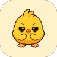
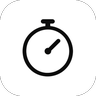

<a href="https://smaranz.me">
  <picture>
    <source media="(prefers-color-scheme: dark)" srcset="assets/header-dark.svg">
    
  </picture>
</a>

 

I'm 15 and I go to Cupertino High. I build with coding agents until the thing feels native, then keep polishing. I also run [CodeStarters](https://codestarters.org), a student nonprofit that teaches younger kids CS and AI.

My site is an agent that knows everything here and more. [Ask it anything](https://smaranz.me).

 

### Building

 &nbsp;**[Slates](https://github.com/smaranz/slates)** &nbsp;A personal operating system for school.

 &nbsp;**[Probe](https://github.com/smaranz/trueforgehackathon)** &nbsp;Your first team of users, before your real users.

 &nbsp;**[Publick](https://www.publick.app/)** &nbsp;Co-founder. Honest answers, campus intel, and the people who already figured it out.

 &nbsp;**[EssayLens](https://www.essaylens.app/)** &nbsp;Essay feedback, graded the way professors actually grade.

 

### Shipped

 &nbsp;**[TrendPilot](https://github.com/smaranz/trendpilot)** &nbsp;Hackathon winner. An AI trend radar that turns rising signals into Shorts.

 &nbsp;**[ClipPilot](https://github.com/smaranz/clippilot)** &nbsp;An autonomous shorts factory with no human in the loop.

 &nbsp;**[ClassFlow](https://classflow-ashen.vercel.app)** &nbsp;An AI student copilot built on top of Google Classroom.

 &nbsp;**[Wingman](https://github.com/rnankani/Wingman)** &nbsp;Your agent talks to their agent, and never says more than you allowed.

 &nbsp;**[Testimer](https://testimer.vercel.app)** &nbsp;A study planner with a single-focus timer.

 &nbsp;**[Notchy](https://github.com/smaranz/notchy)** &nbsp;A free, open-source utility hub for the MacBook notch.

 

### Community

**CodeStarters** &nbsp;Founder and president. A student nonprofit that teaches CS and AI to younger kids and builds free sites for small businesses.

**FireHacks** &nbsp;Lead organizer, August 2026. CodeStarters' free 24-hour hackathon, open to every skill level.

**LovHack** &nbsp;Outreach team. A 48-hour hackathon about shipping real web apps.

**FBLA** &nbsp;AI Development Co-Lead for my chapter. 2nd at States and a Nationals qualifier as a freshman, and the only competitor to build a native Swift app.

 

  
    <a href="https://smaranz.me">smaranz.me</a> &nbsp;·&nbsp;
    <a href="mailto:emailsmaran@gmail.com">email</a> &nbsp;·&nbsp;
    <a href="https://www.instagram.com/smarxnn/">instagram</a> &nbsp;·&nbsp;
    <a href="https://codestarters.org">codestarters</a>
  

